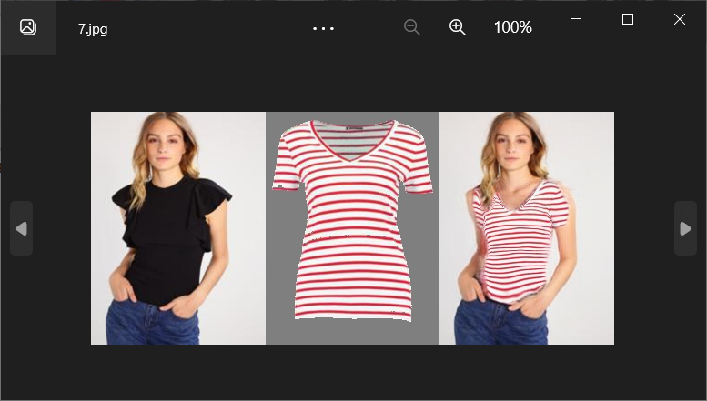

# PF-AFN_test
## Environment  

- anaconda3  
- CUDA 12.2  
- CuPy-cuda12x 12.1.0  
- torch 2.0.1+cu118  
- torchaudio 2.0.2+cu118  
- torchvision 0.15.2+cu118  
- opencv-python 4.7.0.72  
- python 3.9.7  
- GTX 1660Ti for test  

# Change of Environment  
1. If you are utilizing PyCharm to execute this project, kindly ensure that you have downloaded the compatible versions of CUDA, CuPy, GPU-PyTorch, and torchvision.  

2. Due to recent updates in the CuPy version, you may encounter an error message stating ***AttributeError: module 'cupy' has no attribute 'util'*** or ***AttributeError: module 'cupy' has no attribute 'memoize'***. In such cases, please modify the problematic section to `@cupy._util.memoize`.  

3. Please ensure that this demo is not executed in a multi-threaded manner. If you encounter an error message saying ***RuntimeError: DataLoader worker (pid(s) 12076) exited unexpectedly***, it may be due to insufficient shared memory in the CUDA virtual environment. To address this issue, kindly set the value of the `num_workers` parameter in `torch.utils.data.dataloader` and `dataloader.py` to 0, thereby changing it from multi-process to single-process.  

4. If the issue of insufficient GPU memory persists even after making these changes, please follow the steps below to modify the code in test.py:
```python  
    gen_outputs = gen_model(gen_inputs)  
```  
Replace with:  
```python
with torch.no_grad():  
    gen_outputs = gen_model(gen_inputs)
```
By doing so, you will be able to efficiently utilize the available GPU resources for the test.  

5. If you encounter an error message saying ***AttributeError: module 'torchvision.transforms' has no attribute 'Scale'***, kindly modify `Scale` to `Resize`.  
For example:
```python
transform_list.append(transforms.Scale(osize, method))
```
Replace with:  
```python
transform_list.append(transforms.Resize(osize, method))  
```  

# Preparation
1. Dowload the checkpoints from [checkpoints](https://drive.google.com/file/d/1_a0AiN8Y_d_9TNDhHIcRlERz3zptyYWV/view?usp=sharing),and then put the folder "checkpoints/PFAFN" under the folder "PF-AFN_test/checkpoints".The folder "checkpoints/PFAFN" shold contain **warp_model_final.pth** and **gen_model_final.pth**.  

2. The "dataset" folder contains the demo images for test, where the "test_img" folder contains the person images, the "test_clothes" folder contains the clothes images, and the "test_edge" folder contains edges extracted from the clothes images with the built-in function in python (We saved the extracted edges from the clothes images for convenience). 'demo.txt' records the test pairs.  

3. The result will be saved in the folder "results/demo/PFAFN".  

## Output  
The historical results are saved in the "Result" folder.  

It is evident that the performance of the default model provided by the official source is not satisfactory. Due to the lack of training, the generated clothing mostly does not conform well to the human body, resulting in a significant deviation from the expectations stated in the research paper.  
  
  
  

